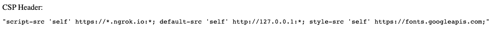
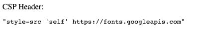

# Cypress CSP Allow Bug

Running the app normally includes all 3 CSP headers (`script-src`, `default-src`, `style-src`):

Running the app with `cypress open` and `experimentalCspAllowList=true` only includes `script-src`:

Running the app with `cypress open` and `experimentalCspAllowList=['script-src', 'default-src']` includes all 3 CSP headers:

